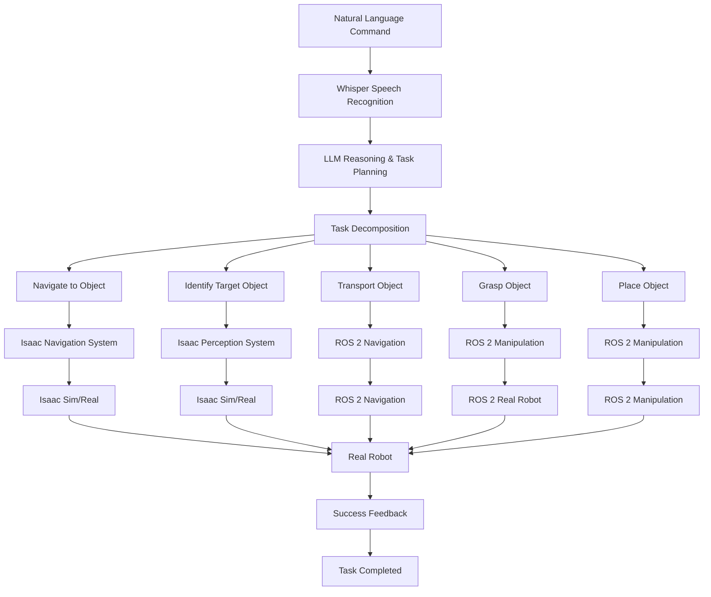

# Capstone Project: Autonomous Humanoid Robot

Welcome to the Capstone Project of the Physical AI & Humanoid Robotics course. This project integrates all concepts learned in the previous modules into a complete autonomous humanoid robot system.

## Project Overview

The capstone project challenges you to build an autonomous humanoid robot that can:
- Take voice commands from users
- Plan navigation paths to reach specified locations
- Identify and locate specific objects in the environment
- Manipulate objects to complete requested tasks

This project brings together all four modules:
- **Module 1 (ROS 2)**: Robotic nervous system and communication
- **Module 2 (Simulation)**: Digital twin and environment modeling
- **Module 3 (Isaac)**: AI-powered perception and navigation
- **Module 4 (VLA)**: Vision-Language-Action integration

## Learning Objectives

By completing this capstone project, you will demonstrate:
- Integration of ROS 2, simulation, Isaac, and VLA systems
- End-to-end autonomous robot functionality
- Problem-solving skills across multiple robotics domains
- Ability to combine perception, planning, and action
- Proficiency with modern robotics tools and frameworks

## Project Requirements

Your autonomous humanoid robot must successfully complete the following sequence:
1. **Voice Command Processing**: Understand and interpret natural language commands
2. **Navigation Planning**: Plan and execute navigation to desired locations
3. **Object Identification**: Detect and identify specific objects in the environment
4. **Object Manipulation**: Manipulate objects to complete the requested task

## System Architecture



## Implementation Phases

### Phase 1: Voice Command Processing
```python
# Example: Voice command processing pipeline
import whisper
import openai
import json

class VoiceCommandProcessor:
    def __init__(self):
        self.whisper_model = whisper.load_model("small")
        self.openai_client = openai.OpenAI(api_key="your-api-key")

    def process_command(self, audio_input):
        # 1. Transcribe audio to text
        transcription = self.whisper_model.transcribe(audio_input)

        # 2. Parse command semantics with LLM
        parsed_command = self.parse_command_with_llm(transcription['text'])

        # 3. Generate task plan
        task_plan = self.generate_task_plan(parsed_command)

        return task_plan

    def parse_command_with_llm(self, command_text):
        response = self.openai_client.chat.completions.create(
            model="gpt-4-turbo",
            messages=[
                {
                    "role": "system",
                    "content": "Parse natural language robot commands into structured format."
                },
                {
                    "role": "user",
                    "content": f"Command: {command_text}\n\n"
                              "Return JSON with: action_type, target_object, destination, "
                              "and any other relevant parameters."
                }
            ],
            response_format={"type": "json_object"}
        )

        return json.loads(response.choices[0].message.content)
```

### Phase 2: Navigation Planning
```python
# Example: Navigation planning with Nav2
import rclpy
from rclpy.node import Node
from geometry_msgs.msg import PoseStamped
from nav2_msgs.action import NavigateToPose
from rclpy.action import ActionClient

class NavigationPlanner(Node):
    def __init__(self):
        super().__init__('navigation_planner')
        self.nav_client = ActionClient(self, NavigateToPose, 'navigate_to_pose')

    def plan_navigation(self, destination):
        # Create navigation goal
        goal_msg = NavigateToPose.Goal()
        goal_msg.pose.header.frame_id = 'map'
        goal_msg.pose.pose.position.x = destination['x']
        goal_msg.pose.pose.position.y = destination['y']
        goal_msg.pose.pose.orientation.w = 1.0

        # Send navigation goal
        self.nav_client.wait_for_server()
        future = self.nav_client.send_goal_async(goal_msg)
        return future
```

### Phase 3: Object Identification
```python
# Example: Object identification with Isaac ROS
import rclpy
from rclpy.node import Node
from sensor_msgs.msg import Image
from vision_msgs.msg import Detection2DArray
from isaac_ros_tensor_list_interfaces.msg import TensorList

class ObjectIdentifier(Node):
    def __init__(self):
        super().__init__('object_identifier')
        self.detection_sub = self.create_subscription(
            Detection2DArray,
            '/object_detections',
            self.detection_callback,
            10
        )

    def detection_callback(self, msg):
        for detection in msg.detections:
            if detection.results[0].hypothesis.class_id == 'target_object':
                self.target_object_found(detection)

    def target_object_found(self, detection):
        # Process detected object information
        object_info = {
            'position': detection.bbox.center.position,
            'confidence': detection.results[0].hypothesis.score,
            'bbox': detection.bbox
        }
        # Continue with manipulation planning
```

### Phase 4: Object Manipulation
```python
# Example: Object manipulation with MoveIt
import rclpy
from rclpy.node import Node
from moveit_msgs.action import MoveGroup
from rclpy.action import ActionClient
from geometry_msgs.msg import Pose

class ObjectManipulator(Node):
    def __init__(self):
        super().__init__('object_manipulator')
        self.move_group_client = ActionClient(self, MoveGroup, 'move_group')

    def grasp_object(self, object_pose):
        # Plan and execute grasp motion
        goal = MoveGroup.Goal()
        # Configure grasp parameters
        # Execute grasp action
        pass

    def place_object(self, target_pose):
        # Plan and execute place motion
        goal = MoveGroup.Goal()
        # Configure place parameters
        # Execute place action
        pass
```

## Integration Architecture

### Main Controller Node
```python
# Example: Main capstone project controller
import rclpy
from rclpy.node import Node
from std_msgs.msg import String, Bool
from enum import Enum

class TaskState(Enum):
    WAITING_FOR_COMMAND = 1
    PROCESSING_COMMAND = 2
    NAVIGATING_TO_OBJECT = 3
    IDENTIFYING_OBJECT = 4
    GRASPING_OBJECT = 5
    TRANSPORTING_OBJECT = 6
    PLACING_OBJECT = 7
    TASK_COMPLETED = 8
    ERROR = 9

class CapstoneController(Node):
    def __init__(self):
        super().__init__('capstone_controller')

        # Initialize subsystems
        self.voice_processor = VoiceCommandProcessor()
        self.navigation_planner = NavigationPlanner()
        self.object_identifier = ObjectIdentifier()
        self.object_manipulator = ObjectManipulator()

        # Publishers and subscribers
        self.command_sub = self.create_subscription(
            String, '/voice_command', self.command_callback, 10
        )
        self.status_pub = self.create_publisher(
            String, '/capstone_status', 10
        )

        # Initialize state
        self.current_state = TaskState.WAITING_FOR_COMMAND
        self.current_task = None

    def command_callback(self, msg):
        """Handle incoming voice commands"""
        if self.current_state == TaskState.WAITING_FOR_COMMAND:
            self.current_state = TaskState.PROCESSING_COMMAND
            self.process_voice_command(msg.data)

    def process_voice_command(self, command):
        """Process voice command and execute task sequence"""
        try:
            # Parse command and generate task plan
            task_plan = self.voice_processor.process_command(command)

            # Execute task sequence
            success = self.execute_task_sequence(task_plan)

            if success:
                self.current_state = TaskState.TASK_COMPLETED
                self.publish_status("Task completed successfully")
            else:
                self.current_state = TaskState.ERROR
                self.publish_status("Task failed")

        except Exception as e:
            self.current_state = TaskState.ERROR
            self.publish_status(f"Error: {str(e)}")

    def execute_task_sequence(self, task_plan):
        """Execute the complete task sequence"""
        # Phase 1: Navigate to object
        if not self.navigate_to_object(task_plan['object_location']):
            return False

        # Phase 2: Identify target object
        if not self.identify_target_object(task_plan['target_object']):
            return False

        # Phase 3: Grasp object
        if not self.grasp_object(task_plan['target_object']):
            return False

        # Phase 4: Transport object
        if not self.transport_object(task_plan['destination']):
            return False

        # Phase 5: Place object
        if not self.place_object(task_plan['destination']):
            return False

        return True

    def publish_status(self, status):
        """Publish task execution status"""
        status_msg = String()
        status_msg.data = status
        self.status_pub.publish(status_msg)
```

## Project Evaluation Criteria

Your project will be evaluated based on:

### Functionality (40%)
- **Voice Command Processing**: Successfully interprets natural language commands
- **Navigation**: Accurately navigates to specified locations
- **Object Identification**: Correctly identifies and locates target objects
- **Manipulation**: Successfully grasps and places objects
- **Task Completion**: Completes requested tasks successfully

### Integration (30%)
- **Module Integration**: Seamlessly integrates all four course modules
- **System Architecture**: Well-designed system architecture with proper component interfaces
- **Data Flow**: Proper data flow between different subsystems
- **Error Handling**: Robust error handling and recovery mechanisms

### Performance (20%)
- **Response Time**: Efficient processing of commands and task execution
- **Accuracy**: High accuracy in object identification and manipulation
- **Reliability**: Consistent performance across multiple trials
- **Resource Usage**: Efficient use of computational resources

### Innovation (10%)
- **Creative Solutions**: Innovative approaches to challenges
- **Advanced Features**: Implementation of additional interesting features
- **Problem Solving**: Effective solutions to complex problems

## Technical Requirements

### Hardware Requirements
- **Robot Platform**: Humanoid robot (simulated or real) with:
  - Mobile base with navigation capabilities
  - Manipulator arms with grippers
  - RGB-D camera for perception
  - Microphone for voice commands
  - Speakers for audio feedback

### Software Requirements
- **ROS 2 Humble Hawksbill**: Main robotics framework
- **Isaac Sim**: For simulation and perception
- **OpenAI Whisper**: For speech recognition
- **Large Language Model**: For command interpretation
- **MoveIt**: For manipulation planning
- **Nav2**: For navigation planning

### Development Environment
- **Ubuntu 22.04 LTS**: Recommended operating system
- **NVIDIA GPU**: For Isaac Sim and perception processing
- **Development Tools**: Git, Docker, Python 3.10+

## Project Timeline

### Week 1: System Setup and Integration
- Set up development environment
- Integrate ROS 2 with Isaac Sim
- Configure voice recognition system
- Set up basic communication between modules

### Week 2: Voice Command Processing
- Implement Whisper-based speech recognition
- Integrate LLM for command interpretation
- Create task planning pipeline
- Test with basic commands

### Week 3: Navigation and Perception
- Configure Nav2 for humanoid navigation
- Set up Isaac perception pipeline
- Implement object detection and identification
- Test navigation and perception separately

### Week 4: Manipulation and Integration
- Implement object manipulation capabilities
- Integrate all subsystems
- Test complete task sequence
- Optimize and debug

### Week 5: Testing and Validation
- Comprehensive testing of complete system
- Performance optimization
- Documentation and presentation preparation
- Final project submission

## Deliverables

### Required Deliverables
1. **Source Code**: Complete, well-documented source code
2. **System Architecture Diagram**: Detailed system architecture
3. **Technical Report**: Comprehensive report explaining implementation
4. **Video Demonstration**: Video showing system in action
5. **Presentation**: Project presentation (10-15 minutes)

### Optional Enhancements
1. **Multi-object Tasks**: Handle tasks involving multiple objects
2. **Learning Capabilities**: Implement learning from experience
3. **Human-Robot Interaction**: Enhanced interaction modalities
4. **Robustness Improvements**: Better error handling and recovery
5. **Performance Optimizations**: Improved efficiency and speed

## Resources and References

### Documentation
- [ROS 2 Documentation](https://docs.ros.org/)
- [Isaac Sim Documentation](https://docs.omniverse.nvidia.com/isaacsim/latest/)
- [Isaac ROS Documentation](https://nvidia-isaac-ros.github.io/)
- [Whisper Documentation](https://github.com/openai/whisper)

### Tutorials and Examples
- [ROS 2 Tutorials](https://docs.ros.org/en/humble/Tutorials.html)
- [MoveIt Tutorials](https://moveit.picknik.ai/humble/doc/tutorials.html)
- [Nav2 Tutorials](https://navigation.ros.org/tutorials/)

## Getting Started

### Initial Setup
1. Clone the project repository
2. Set up ROS 2 development environment
3. Install Isaac Sim and required dependencies
4. Configure API keys for LLM services
5. Verify basic system functionality

### Sample Project Structure
```
capstone-project/
├── src/
│   ├── voice_processing/
│   ├── navigation_planning/
│   ├── object_identification/
│   ├── manipulation_control/
│   └── main_controller/
├── config/
├── launch/
├── test/
└── docs/
```

## Success Metrics

### Quantitative Metrics
- **Task Success Rate**: ≥ 80% successful task completions
- **Command Interpretation Accuracy**: ≥ 90% correct command parsing
- **Object Identification Accuracy**: ≥ 85% correct object detection
- **Navigation Success Rate**: ≥ 90% successful navigation
- **Average Response Time**: ≤ 5 seconds per command

### Qualitative Metrics
- **Robustness**: Handles various environmental conditions
- **Adaptability**: Adjusts to unexpected situations
- **User Experience**: Natural and intuitive interaction
- **Maintainability**: Clean, well-documented code

## Conclusion

The capstone project represents the culmination of your learning in the Physical AI & Humanoid Robotics course. It challenges you to integrate all concepts learned across the four modules into a cohesive, functioning autonomous system. Success in this project demonstrates mastery of modern robotics technologies and the ability to build complex, integrated systems.

Remember to approach the project systematically, test components individually before integration, and document your work thoroughly. Good luck with your capstone project!